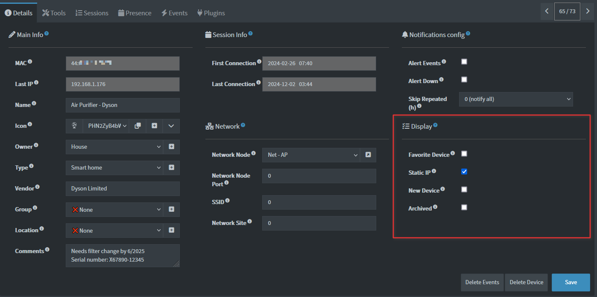

# Device Display Settings

This set of settings allows you to group Devices under different views. The Archived toggle allows you to exclude a Device from most listings and notifications.

## Status Colors

| Icon      | Status                 | Image                                                                 | Description                                                                                   |
|-----------|------------------------|-----------------------------------------------------------------------|-----------------------------------------------------------------------------------------------|
| <i class="fa-solid fa-plug"></i>     | Online (Green)         |  | A device that is no longer marked as a "New Device".                                 |
| <i class="fa-solid fa-plug"></i>       | New (Green)            |  | A newly discovered device that is online and is still marked as a "New Device".  |
| <i class="fa-solid fa-plug-circle-exclamation"></i>   | Online (Orange)        |  | The device is online, but unstable and flapping (3 status changes in the last hour).     |
| <i class="fa-solid fa-xmark"></i>      | New (Grey)             |  | Same as "New (Green)" but the device is now offline.                            |
| <i class="fa-solid fa-xmark"></i>      | Offline (Grey)         |  | A device that was not detected online in the last scan.                             |
| <i class="fa-solid fa-triangle-exclamation"></i>       | Down (Red)             |    | A device marked as "Alert Down" and offline for the duration set in `NTFPRCS_alert_down_time`.|

See also [Notification guide](./NOTIFICATIONS.md).