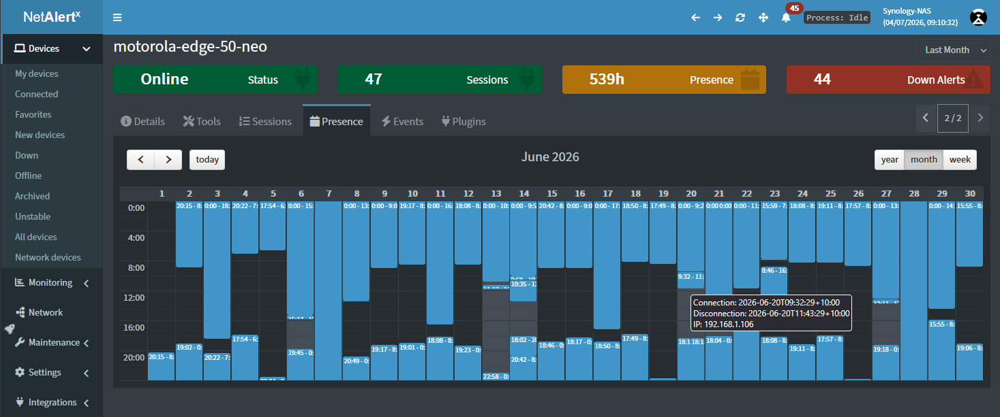

## Presence View

The **Presence View** provides a visual timeline of when each device was detected on your network, making it easy to understand activity over time instead of relying only on the current status.

Use this view to answer questions such as:

* When was this device first discovered?
* When was it last seen online?
* How often does this device connect to the network?
* Has the device been continuously online or only appearing intermittently?
* When did the device disappear or return?

The timeline makes it easy to identify recurring activity patterns, unexpected outages, or devices that only appear at certain times of the day or week.

### Timeline Views

The timeline can be displayed at different time scales depending on the level of detail you need:

* **Week** – View recent activity with the highest level of detail.
* **Month** – Review activity across the past month.
* **Year** – Get a long-term overview of device presence and seasonal patterns.

Switch between these views using the **Week**, **Month**, and **Year** buttons above the timeline.

### Timeline Legend

The timeline uses color coding to indicate device presence:

* 

 **Now online** – The device was detected during the most recent scan and is currently online.
* 

 **Past online** – The device was online previously but is currently offline.
* 

 **Past online (mismatch)** – Historical activity was detected, but the beginning of the session could not be determined or conflicting data was encountered.

### Typical Uses

The Presence View is especially useful for:

* Troubleshooting intermittent connectivity issues.
* Identifying devices that frequently disconnect and reconnect.
* Understanding occupancy or usage patterns for phones, laptops, IoT devices, and other network equipment.
* Verifying when visitors' devices or temporary equipment were present on the network.
* Reviewing historical presence without searching through individual events or logs.

Unlike the Device Details page, which shows the current state of a device, the Presence View focuses on **when** devices were active, providing valuable historical context at a glance. To investigate exactly **what** changed during a device's lifetime, see the [Change Log](./DEVICE_CHANGE_LOG.md).
