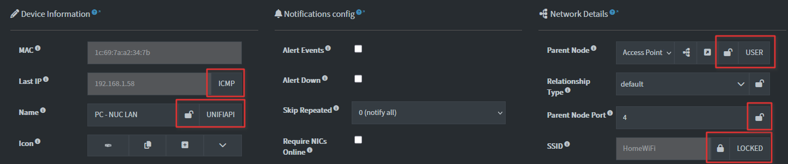

# Understanding Device Source Fields and Field Updates

When the system scans a network, it finds various details about devices (like names, IP addresses, and manufacturers). To ensure the data remains accurate without accidentally overwriting manual changes, the system uses a set of "Source Rules."

---

## The "Protection" Levels

Every piece of information for a device has a **Source**. This source determines whether a new scan is allowed to change that value.

| Source Status | Description | Can a Scan Overwrite it? |
| --- | --- | --- |
| **USER** | You manually entered this value. | **Never** |
| **LOCKED** | This value is pinned and protected. | **Never** |
| **NEWDEV** | This value was initialized from `NEWDEV` plugin settings. | **Always** |
| **(Plugin Name)** | The value was found by a specific scanner (e.g., `NBTSCAN`). | **Only if specific rules are met** |

---

## How Scans Update Information

If a field is **not** protected by a `USER` or `LOCKED` status, the system follows these rules to decide if it should update the info:

### 1. The "Empty Field" Rule (Default)

By default, the system is cautious. It will only fill in a piece of information if the current field is **empty** (showing as "unknown," "0.0.0.0," or blank). It won't change for example an existing name unless you tell it to.

### 2. SET_ALWAYS

Some plugins are configured to be "authoritative." If a field is in the **SET_ALWAYS** setting of a plugin:

* The scanner will **always** overwrite the current value with the new one.
* *Note: It will still never overwrite a `USER` or `LOCKED` field.*

### 3. SET_EMPTY

If a field is in the **SET_EMPTY** list:

* The scanner will **only** provide a value if the current field is currently empty.
* This is used for fields where we want to "fill in the blanks" but never change a value once it has been established by any source.

### 4. Automatic Overrides (Live Tracking)

Some fields, like **IP Addresses** (`devLastIP`) and **Full Domain Names** (`devFQDN`), are set to automatically update whenever they change. This ensures that if a device moves to a new IP on your network, the system reflects that change immediately without you having to do anything.

---

## Summary of Field Logic

| If the current value is... | And the Scan finds... | Does it update? |
| --- | --- | --- |
| **USER / LOCKED** | Anything | **No** |
| **Empty** | A new value | **Yes** |
| **A "Plugin" value** | A different value | **No** (Unless `SET_ALWAYS` is on) |
| **An IP Address** | A different IP | **Yes** (Updates automatically) |

## See also:

- [Device locking](./DEVICE_FIELD_LOCK.md)
- [Device source fields](./DEVICE_SOURCE_FIELDS.md)
- [API Device Endpoints Documentation](./API_DEVICE.md)
- [Authoritative Field Updates System](./PLUGINS_DEV.md#authoritative-fields)
- [Plugin Configuration Reference](./PLUGINS_DEV_CONFIG.md)
- [Device locking APIs](API_DEVICE_FIELD_LOCK.md)
- [Device management](DEVICE_MANAGEMENT.md)
