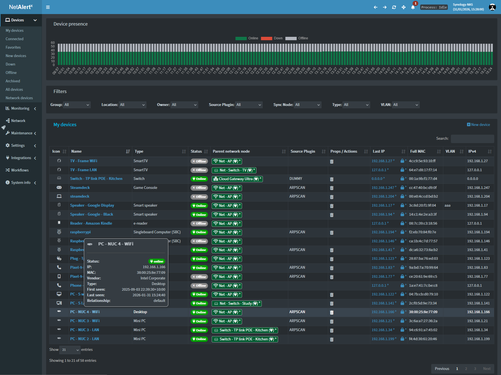
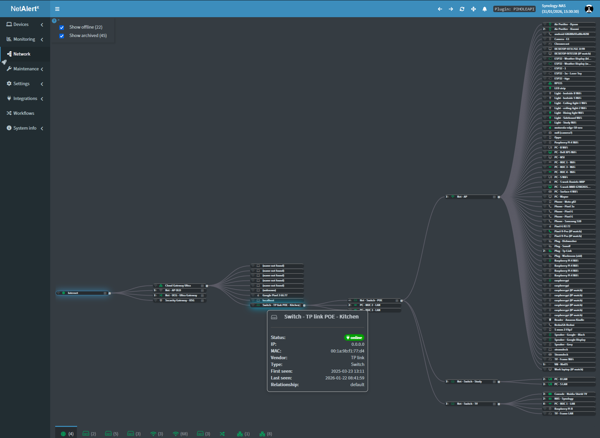
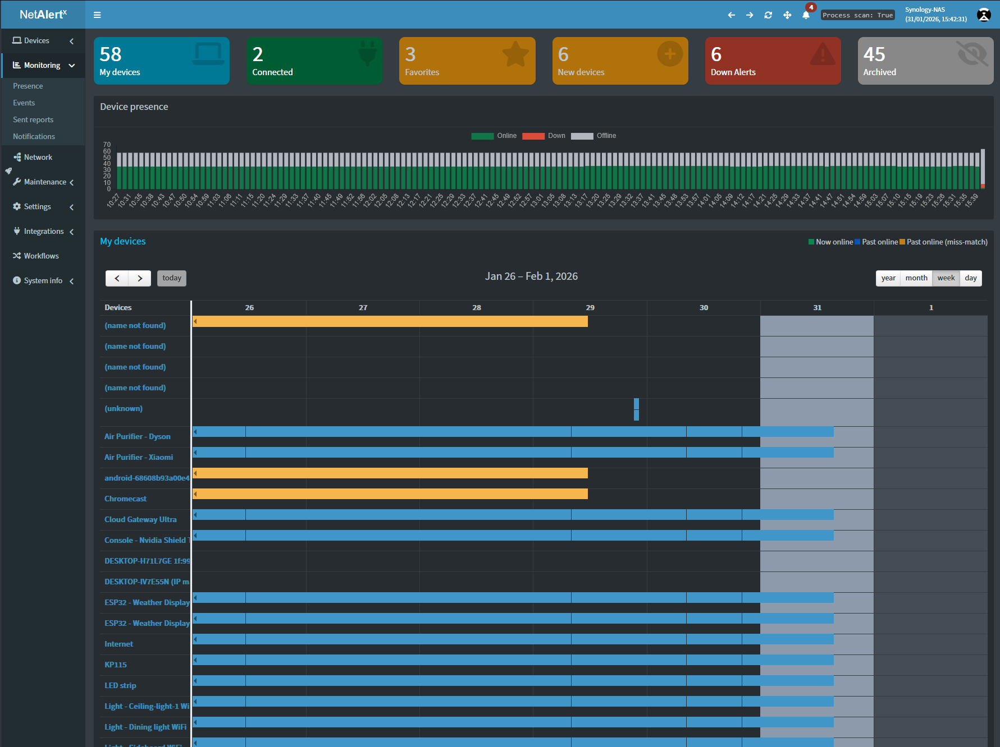
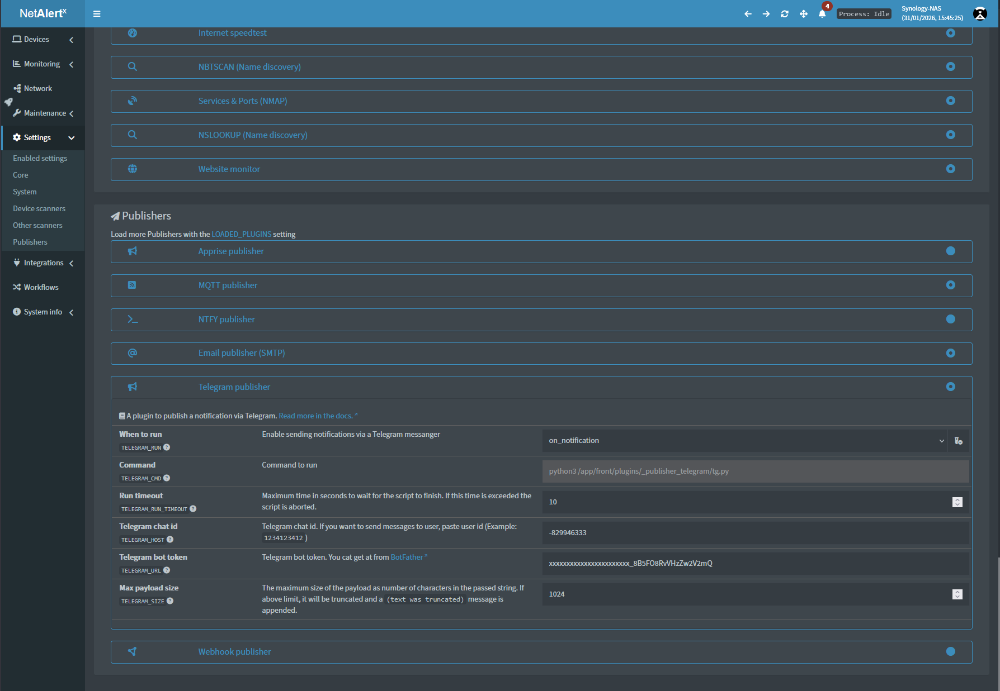
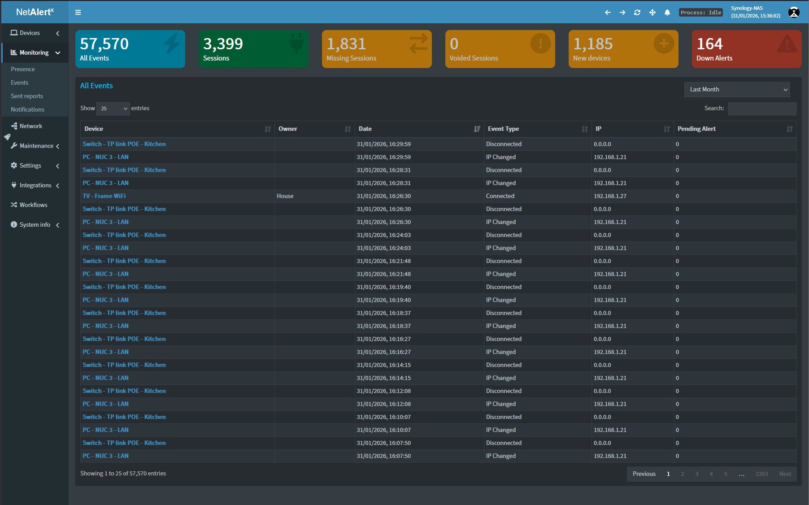
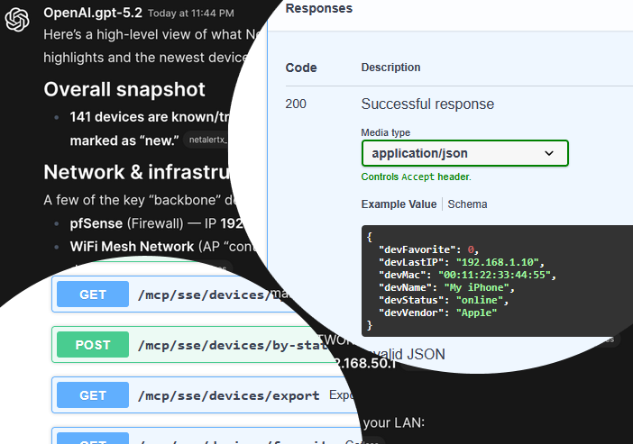
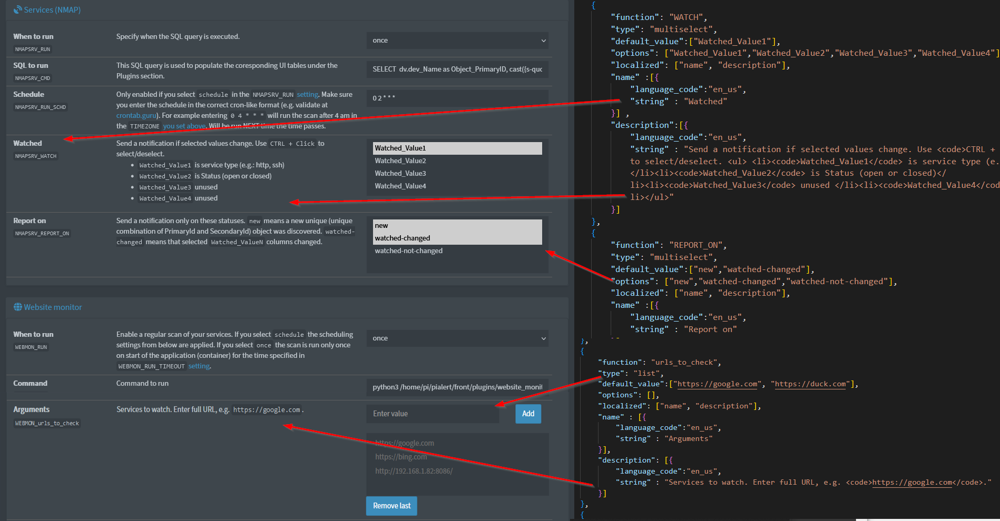

# NetAlertX Features Overview

NetAlertX is a lightweight, flexible platform for monitoring networks, tracking devices, and delivering actionable alerts. It combines discovery, change detection, and multi-channel notification into a single, streamlined solution.

---

## Network Discovery & Device Tracking

- **Automatic Device Detection**: Continuously scans your local network to detect all connected devices via ARP, DHCP, SNMP, and compatible controllers.
- **Presence Monitoring**: Track when devices appear, disappear, or reconnect on the network.
- **IP & MAC Tracking**: Log device IP changes, ensuring accurate identification over time.
- **Import from Existing Systems**: Integrates with DHCP servers, Pi-hole, UniFi controllers, and other supported sources to maintain an accurate inventory.

---

## LAN Visualization

- **Lightweight Network Map**: View a real-time representation of your local network with all connected devices.
- **Device Status Indicators**: Quickly identify active, missing, or new devices at a glance.
- **Interactive Overview**: Hover over devices to see IP, MAC, and last seen timestamps.
- **Change Highlighting**: Newly detected, disconnected, or reconnected devices are visually flagged to reduce oversight.
- **Simple & Efficient**: Designed for quick insights without heavy resource usage or complex topology maps.

---

## Event-Driven Alerts

- **Real-Time Notifications**: Receive immediate alerts for new devices, disconnected devices, or unexpected changes.
- **Customizable Triggers**: Define rules based on device type, IP ranges, presence, or other network parameters.
- **Alert Deduplication & Suppression**: Avoid unnecessary noise with smart alert handling.
- **Historical Logs**: Maintain a complete timeline of network events for review and reporting.

---

## Multi-Channel Notification

- **Flexible Delivery Options**: Send alerts via email, webhooks, MQTT, and more.
- **Integration with Automation**: Connect to ticketing systems, workflow engines, and custom scripts for automated responses.
- **Apprise Support**: Utilize over 80 pre-built notification services without additional configuration.

---

## Security & Compliance-Friendly Logging

- **Device Accountability**: Maintain an auditable record of every device that appears or disappears from the network.
- **Change Tracking**: Document network events with timestamps for review and compliance reporting.
- **Rogue Device Alerts**: Detect and respond to unexpected or unauthorized network connections.

---

## MCP Server and OpenAPI

- **Data Access & Interaction**: The MCP server provides full programmatic access to NetAlertX, allowing you to query, monitor, and interact with network and device data.
- **OpenAPI Integration**: Use the OpenAPI interface to fetch device status, network events, and logs, or trigger actions and alerts programmatically.
- **Full Transparency**: All scan results, logs, and device information are accessible via the API, enabling auditing, automation, or integration with external systems.
- **Flexible & Reliable**: Structured API access ensures predictable, repeatable interactions while allowing real-time data monitoring and operational control.

---

## Extensible & Open Source

- **Plugin System**: Extend discovery methods, ingestion types, or notification channels through modular plugins.
- **Community Contributions**: Open-source architecture encourages collaboration and improvements.
- **Full Transparency**: All logs, scans, and configurations are visible for analysis.

---

NetAlertX provides a centralized, proactive approach to network awareness, combining device visibility, event-driven alerting, and flexible notifications into a single, deployable solution. Its design prioritizes efficiency, clarity, and actionable insights, making it ideal for monitoring dynamic environments.
