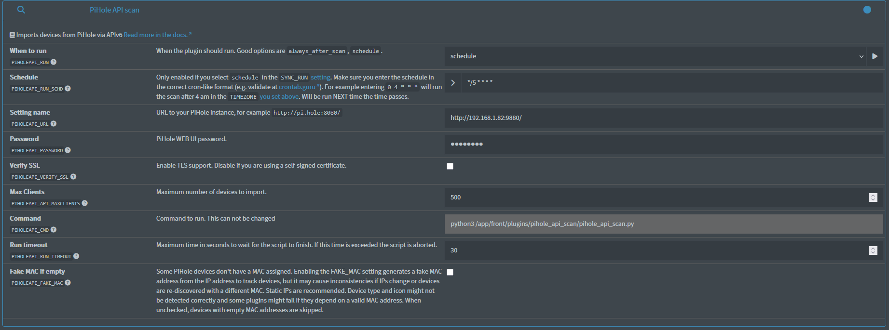
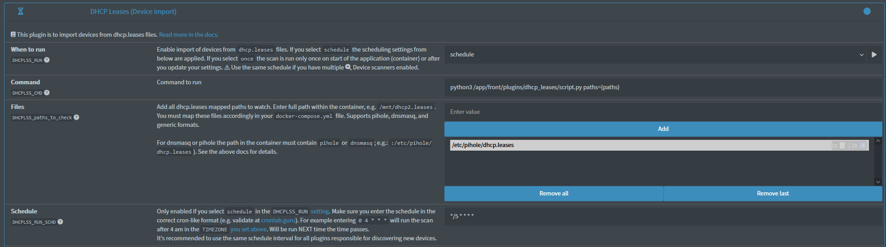
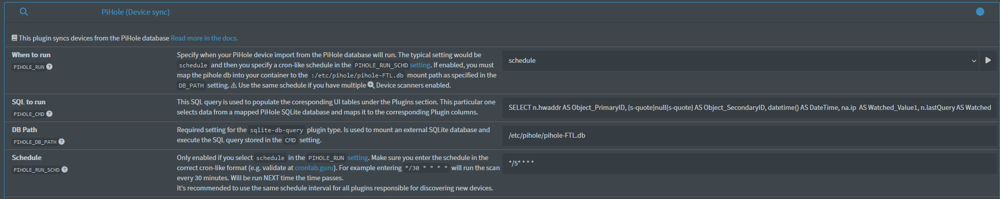

# Integration with Pi-hole

NetAlertX includes three plugins for integrating with an existing Pi-hole installation. The first plugin imports devices through the Pi-hole v6 API, the second parses the `dhcp.leases` file generated by Pi-hole, and the third reads the Pi-hole SQLite database directly. You can use any of these approaches individually or combine them with each other and other [plugins](/docs/PLUGINS.md).

## Approach 1: `PIHOLEAPI` Plugin - Import devices directly from the Pi-hole v6 API

To use this approach, make sure a Web UI password is configured in **Pi-hole**.

### Settings

| Setting                    | Description                                                                                      | Recommended value           |
| :------------------------- | :----------------------------------------------------------------------------------------------- | :-------------------------- |
| `PIHOLEAPI_URL`            | Your Pi-hole base URL, including the port.                                                       | `http://192.168.1.82:9880/` |
| `PIHOLEAPI_RUN_SCHD`       | If you run multiple device scanner plugins, configure them to use the same schedule.             | `*/5 * * * *`               |
| `PIHOLEAPI_PASSWORD`       | The Pi-hole Web UI admin password. NetAlertX automatically handles Base64 encoding and decoding. | `passw0rd`                  |
| `PIHOLEAPI_SSL_VERIFY`     | Whether to verify HTTPS certificates. Disable only when using self-signed certificates.          | `False`                     |
| `PIHOLEAPI_API_MAXCLIENTS` | Maximum number of devices to request from Pi-hole. The default value is usually sufficient.      | `500`                       |
| `PIHOLEAPI_FAKE_MAC`       | Generate a deterministic fake MAC address from the IP address.                                   | `False`                     |

Check the [PIHOLEAPI plugin README](https://github.com/netalertx/NetAlertX/tree/main/front/plugins/pihole_api_scan/) for additional details and troubleshooting.

### docker-compose changes

No changes are required.

---

## Approach 2: `DHCPLSS` Plugin - Import devices from the Pi-hole DHCP leases file

This approach requires mounting the Pi-hole DHCP leases file (`dhcp.leases`) into the NetAlertX container. This is straightforward when both applications run on the same host. If they run on different hosts, you'll need to synchronize the file or use the `PIHOLEAPI` plugin instead.

### Settings

| Setting                  | Description                                                                                                                                        | Recommended value             |
| :----------------------- | :------------------------------------------------------------------------------------------------------------------------------------------------- | :---------------------------- |
| `DHCPLSS_RUN`            | When the plugin should run.                                                                                                                        | `schedule`                    |
| `DHCPLSS_RUN_SCHD`       | If you run multiple device scanner plugins, configure them to use the same schedule.                                                               | `*/5 * * * *`                 |
| `DHCPLSS_paths_to_check` | Path to the mapped `dhcp.leases` file inside the container. The path must include `pihole` so the plugin can identify it as a Pi-hole leases file. | `['/etc/pihole/dhcp.leases']` |

Check the [DHCPLSS plugin README](https://github.com/netalertx/NetAlertX/tree/main/front/plugins/dhcp_leases#overview) for additional details.

### docker-compose changes

| Path                       | Description                                                                                    |
| :------------------------- | :--------------------------------------------------------------------------------------------- |
| `:/etc/pihole/dhcp.leases` | Mount Pi-hole's `dhcp.leases` file. This path must match an entry in `DHCPLSS_paths_to_check`. |

---

## Approach 3: `PIHOLE` Plugin - Import devices directly from the Pi-hole database

This approach requires mounting the Pi-hole database file into the NetAlertX container. This is straightforward when both applications run on the same host. If Pi-hole is running on a different host, you'll need to synchronize the database file into the NetAlertX container. In that scenario, the `PIHOLEAPI` or `DHCPLSS` plugins are usually simpler.

### Settings

| Setting           | Description                                                                          | Recommended value           |
| :---------------- | :----------------------------------------------------------------------------------- | :-------------------------- |
| `PIHOLE_RUN`      | When the plugin should run.                                                          | `schedule`                  |
| `PIHOLE_RUN_SCHD` | If you run multiple device scanner plugins, configure them to use the same schedule. | `*/5 * * * *`               |
| `PIHOLE_DB_PATH`  | Path to the mapped Pi-hole database file inside the container.                       | `/etc/pihole/pihole-FTL.db` |

Check the [PIHOLE plugin README](https://github.com/netalertx/NetAlertX/tree/main/front/plugins/pihole_scan) for additional details.

### docker-compose changes

| Path                         | Description                                    |
| :--------------------------- | :--------------------------------------------- |
| `:/etc/pihole/pihole-FTL.db` | Mount Pi-hole's `pihole-FTL.db` database file. |

---

Explore other [plugins](/docs/PLUGINS.md) to discover additional information about your network, or learn how to scan [remote networks](./REMOTE_NETWORKS.md).
