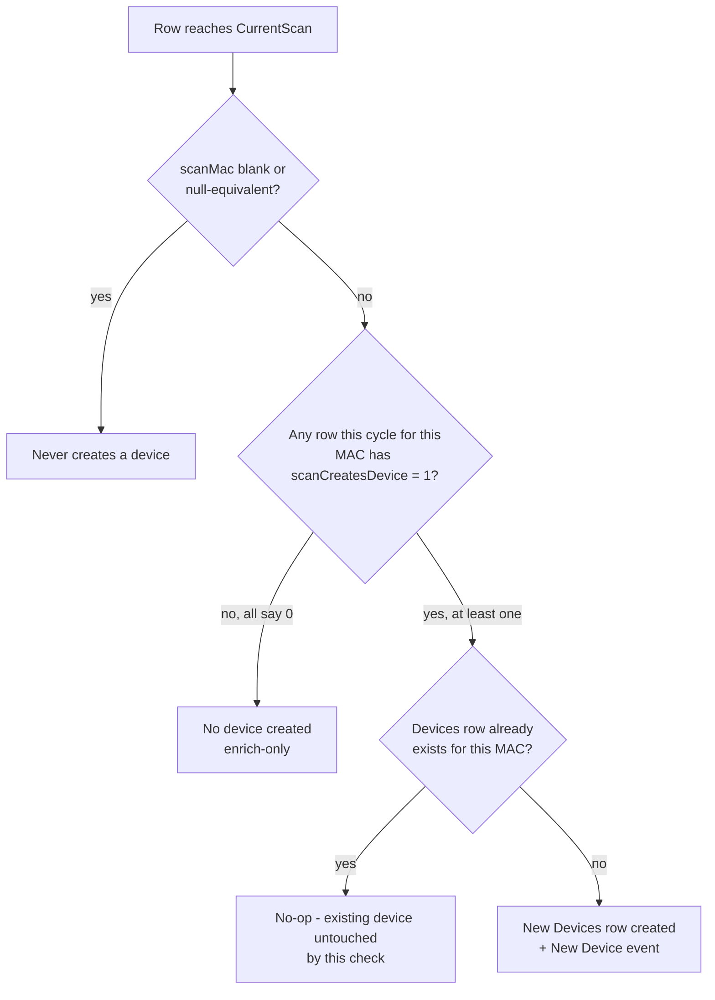
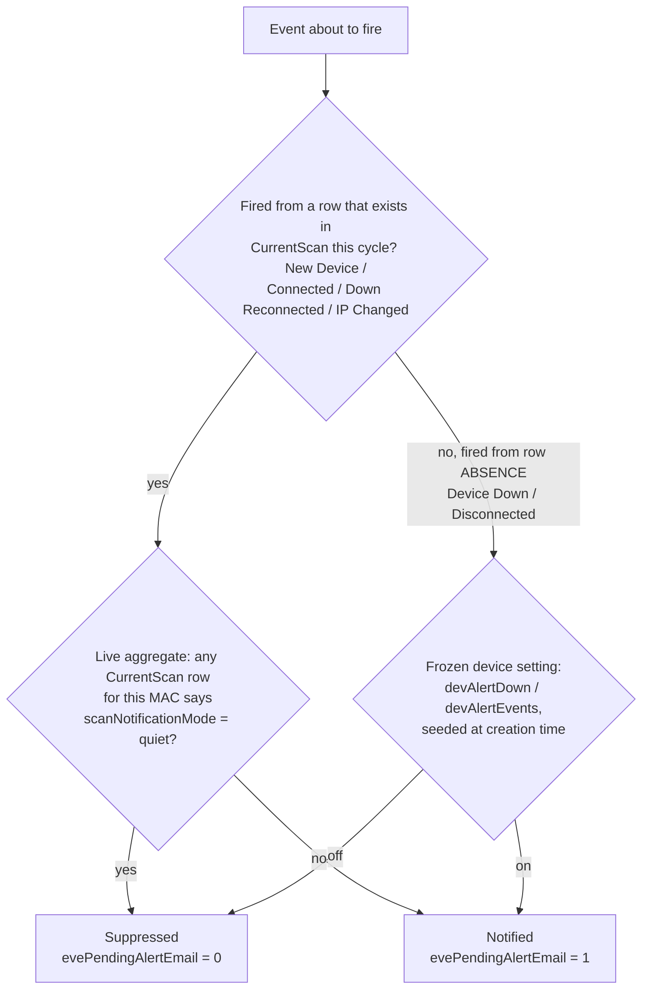

# Plugin Data Contract

This document specifies the exact interface between plugins and the NetAlertX core.

> [!IMPORTANT]
> Every plugin must output data in this exact format to be recognized and processed correctly.

## Overview

Plugins communicate with NetAlertX by writing results to a **pipe-delimited log file**. The core reads this file, parses the data, and processes it for notifications, device discovery, and data integration.

**File Location:** `/tmp/log/plugins/last_result.<PREFIX>.log`

**Format:** Pipe-delimited (`|`), one record per line

**Required Columns:** 9 (mandatory) + up to 4 optional helper columns = 13 total


## Using `plugin_helper.py`

The easiest way to ensure correct output is to use the [`plugin_helper.py`](https://github.com/netalertx/NetAlertX/blob/main/server/plugins/plugin_helper.py) library:

```python
from plugin_helper import Plugin_Objects

# Initialize with your plugin's prefix
plugin_objects = Plugin_Objects("YOURPREFIX")

# Add objects
plugin_objects.add_object(
    objectPrimaryId="device_id",
    objectSecondaryId="192.168.1.1",
    DateTime="2023-01-02 15:56:30",
    watchedValue1="online",
    watchedValue2="null",
    watchedValue3="null",
    watchedValue4="null",
    Extra="Additional data",
    ForeignKey="aa:bb:cc:dd:ee:ff",
    helpVal1="null",
    helpVal2="null",
    helpVal3="null",
    helpVal4="null"
)

Please note unavailable values need to be set to `"null"` 

# Write results (handles formatting, sanitization, and file creation)
plugin_objects.write_result_file()
```

The library automatically:

- Validates data types
- Sanitizes string values
- Normalizes MAC addresses
- Writes to the correct file location
- Creates the file in `/tmp/log/plugins/last_result.<PREFIX>.log`

## Column Specification

> [!NOTE]
> The order of columns is **FIXED** and cannot be changed. All 9 mandatory columns must be provided. If you use any optional column (`helpVal1`), you must supply all optional columns (`helpVal1` through `helpVal4`).

### Mandatory Columns (0–8)

| Order | Column Name | Type | Required | Description |
|-------|-------------|------|----------|-------------|
| 0 | `objectPrimaryId` | string | **YES** | The primary identifier for grouping. Examples: device MAC, hostname, service name, or any unique ID |
| 1 | `objectSecondaryId` | string | no | Secondary identifier for relationships (e.g., IP address, port, sub-ID). Use `null` if not needed |
| 2 | `DateTime` | string | **YES** | Timestamp when the event/data was collected. Format: `YYYY-MM-DD HH:MM:SS` |
| 3 | `watchedValue1` | string | **YES** | Primary watched value. Changes trigger notifications. Examples: IP address, status, version |
| 4 | `watchedValue2` | string | no | Secondary watched value. Use `null` if not needed |
| 5 | `watchedValue3` | string | no | Tertiary watched value. Use `null` if not needed |
| 6 | `watchedValue4` | string | no | Quaternary watched value. Use `null` if not needed |
| 7 | `Extra` | string | no | Any additional metadata to display in UI and notifications. Use `null` if not needed |
| 8 | `ForeignKey` | string | no | Foreign key linking to parent object (usually MAC address for device relationship). Use `null` if not needed |

### Optional Columns (9–12)

| Order | Column Name | Type | Required | Description |
|-------|-------------|------|----------|-------------|
| 9 | `helpVal1` | string | *conditional* | Helper value 1. If used, all help values must be supplied |
| 10 | `helpVal2` | string | *conditional* | Helper value 2. If used, all help values must be supplied |
| 11 | `helpVal3` | string | *conditional* | Helper value 3. If used, all help values must be supplied |
| 12 | `helpVal4` | string | *conditional* | Helper value 4. If used, all help values must be supplied |

> **Note:** `plugin_helper.py`'s `Plugin_Object.__init__` defaults an omitted/`None` `helpVal1-4` to `""` - a real `0` or `False` you pass explicitly is preserved as-is (checked via `is not None`, not truthiness), same as `watchedValue1-4`.

## Usage Guide

### Empty/Null Values

- Represent empty values as the literal string `null` (not Python `None`, SQL `NULL`, or empty string)
- Example: `device_id|null|2023-01-02 15:56:30|status|null|null|null|null|null`

### Watched Values

**What are Watched Values?**

Watched values are fields that the NetAlertX core monitors for **changes between scans**. When a watched value differs from the previous scan, it can trigger notifications.

**How to use them:**

- `watchedValue1`: Always required; primary indicator of status/state
- `watchedValue2–4`: Optional; use for secondary/tertiary state information
- Leave unused ones as `null`

**Example:**

- Device scanner: `watchedValue1 = "online"` or `"offline"`
- Port scanner: `watchedValue1 = "80"` (port number), `watchedValue2 = "open"` (state)
- Service monitor: `watchedValue1 = "200"` (HTTP status), `watchedValue2 = "0.45"` (response time)

### Foreign Key

Use the `ForeignKey` column to link objects to a parent device by MAC address:

```
device_name|192.168.1.100|2023-01-02 15:56:30|online|null|null|null|Found on network|aa:bb:cc:dd:ee:ff
                                                                                              ↑
                                                                                        ForeignKey (MAC)
```

This allows NetAlertX to:

- Display the object on the device details page
- Send notifications when the parent device is involved
- Link events across plugins


### Target columns for config.json

Typically, target columns would be pointing to the `CurrentScan` table, so, e.g. `scanSite` or `scanLastIP`. This mapping is defined in the `config.json` of the given plugin. As of writing this article, the `CurrentScan` table is defined as follows:

```sql
CREATE TABLE CurrentScan (
                                scanMac STRING(50) NOT NULL COLLATE NOCASE,
                                scanLastIP STRING(50) NOT NULL COLLATE NOCASE,
                                scanVendor STRING(250),
                                scanSourcePlugin STRING(10),
                                scanName STRING(250),
                                scanLastQuery STRING(250),
                                scanLastConnection STRING(250),
                                scanSyncHubNode STRING(50),
                                scanSite STRING(250),
                                scanSSID STRING(250),
                                scanVlan STRING(250),
                                scanParentMAC STRING(250),
                                scanParentPort STRING(250),
                                scanType STRING(250),
                                scanCreatesDevice BOOLEAN NOT NULL DEFAULT (1) CHECK (scanCreatesDevice IN (0, 1)),
                                scanNotificationMode STRING(10) NOT NULL DEFAULT ('normal'),
                                scanPresence BOOLEAN NOT NULL DEFAULT (1) CHECK (scanPresence IN (0, 1))
)
```

As the documentation might become outdated, it's good practice to check the latest definition of the `CurrentScan` table in `server/db/db_upgrade.py`'s `ensure_CurrentScan()` (the version that actually runs) in the code base. `app.sql` bootstraps the schema for every fresh install, but `CurrentScan` is one of the few tables `ensure_CurrentScan()` unconditionally drops and recreates on every startup, so `app.sql`'s copy of it never actually persists.

### Import Behavior Columns

Three optional `CurrentScan` columns, all independent of each other, control what happens once a row reaches the table.

| Column | Type | Default | Meaning |
|---|---|---|---|
| `scanCreatesDevice` | boolean | `1` | Whether this row can originate a *new* `Devices` entry. `0` lets an enrich-only plugin (e.g. a hostname resolver) update an already-existing device's fields without ever being able to create one. |
| `scanNotificationMode` | text (`normal` \| `quiet`) | `normal` | Whether this row's notifications are suppressed. `quiet` still writes the `Events` row (audit trail intact) but suppresses the outbound email/push. Checked two different ways depending on the event: **live**, as a per-cycle aggregate, for any event fired from a row that exists in `CurrentScan` this cycle (`New Device`, `Connected`, `Down Reconnected`, `IP Changed`) — reclassifying a plugin's row does change these going forward. Note `New Device` isn't gated on `scanPresence = 1` the way the other three are (see the flowcharts below) — it still uses this same live check, just without a presence requirement. **Frozen**, via `devAlertDown`/`devAlertEvents` seeded onto the device at creation time, for events fired from row *absence* (`Device Down`, `Disconnected`) — there's no live `CurrentScan` row to read at that moment, so reclassifying later does not retroactively change an already-created device's alert settings for these two event types. |
| `scanPresence` | boolean | `1` | Whether this row asserts the device is *currently online*. `0` means "identity/inventory data, no presence claim" — not "offline". A reservation, a lease record, or a static IPAM entry are typical `0` cases. |

**Missing vs. invalid values — these behave differently, not interchangeably:**

| Column | Column never mapped (missing) | Mapped but sent an unexpected value (invalid) |
|---|---|---|
| `scanCreatesDevice` | `1` (schema `DEFAULT`) | `CHECK (scanCreatesDevice IN (0, 1))` — anything else fails the `INSERT` outright, it does not silently fall back to `1` |
| `scanNotificationMode` | `normal` (schema `DEFAULT`) | No `CHECK` constraint — any string other than the literal `'quiet'` is treated as `normal`, since the SQL only special-cases that exact value |
| `scanPresence` | `1` (schema `DEFAULT`) | `CHECK (scanPresence IN (0, 1))` — same as `scanCreatesDevice`, invalid values fail the `INSERT`, they don't default |

**Multiple plugins reporting the same MAC in the same scan cycle** (the normal case, not an edge case — see the `scan-pipeline` skill) resolve per column, not uniformly: `scanCreatesDevice` and `scanPresence` are most-permissive-wins (any row saying `1` wins), while `scanNotificationMode` is most-*restrictive*-wins (any row saying `quiet` suppresses the notification, even if a sibling row says `normal`) — erring toward under-notifying rather than spamming.

**Combination matrix** — not every combination is meaningful for every plugin; pick the one that matches what your plugin actually knows:

| `scanCreatesDevice` | `scanPresence` | Meaning |
|---|---|---|
| 1 | 1 | Normal discovery (the default) |
| 1 | 0 | Inventory/identity import — create the device, but don't claim it's online right now |
| 0 | 1 | Presence-confirming enrichment — never originate a device, but assert presence for one that exists |
| 0 | 0 | Silent enrichment — never originate a device, no presence claim either |

`scanNotificationMode` is orthogonal to both of the above and can be combined with any row in the table (e.g. inventory import + quiet, for a fully silent bulk import of known-offline devices).

**Decision: does this row create a device?**



**Decision: is this event's notification suppressed?**



**Worked scenarios:**

| Scenario | `scanCreatesDevice` | `scanPresence` | `scanNotificationMode` | `scanMac` | Outcome |
|---|---|---|---|---|---|
| Normal discovery (default plugin behavior) | `1` (default) | `1` (default) | `normal` (default) | real MAC | Device created if new, notified normally, presence tracked live. |
| Enrich-only plugin (e.g. a hostname resolver) | `0` | `1` (default) | `normal` (default) | real MAC | Never originates a device; still updates an existing device's fields via `FIELD_SPECS`. If another plugin reports the same MAC with `scanCreatesDevice = 1`, the device still gets created (most-permissive-wins) — this plugin's `0` doesn't block it. |
| Bulk inventory import of known-offline devices | `1` | `0` | `quiet` | real MAC | Creates devices without claiming they're online, and without a wave of "New Device" notifications for a large batch import. |
| Presence-confirming enrichment (e.g. a DHCP lease scanner) | `0` | `1` | `normal` | real MAC | Confirms an *existing* device is online without ever being the plugin that creates it. |
| Row with no usable device identity (e.g. an object with no routable MAC available) | `0` | irrelevant | irrelevant | blank / null-equivalent | Never creates a device — but not for symmetric reasons. The blank-MAC guard blocks the whole aggregated group by its shared `scanMac` value, regardless of any individual row's `scanCreatesDevice` (even a stray `1` from an unrelated plugin sharing the same blank `scanMac` can't override it). Setting `scanCreatesDevice = 0` here is still correct practice, but on its own is only this row's vote — most-permissive-wins means a sibling row for the same `scanMac` asserting `1` would still win. The blank-MAC guard is what actually guarantees safety regardless of what other contributors do. |

## Examples

### Valid Data (9 columns, minimal)

```csv
https://example.com|null|2023-01-02 15:56:30|200|null|null|null|null|null
printer-hp-1|192.168.1.50|2023-01-02 15:56:30|online|50%|null|null|Last seen in office|aa:11:22:33:44:55
gateway.local|null|2023-01-02 15:56:30|active|v2.1.5|null|null|Firmware version|null
```

### Valid Data (13 columns, with helpers)

```csv
service-api|192.168.1.100:8080|2023-01-02 15:56:30|200|45ms|true|null|Responding normally|aa:bb:cc:dd:ee:ff|extra1|extra2|extra3|extra4
host-web-1|10.0.0.20|2023-01-02 15:56:30|active|256GB|online|ok|Production server|null|cpu:80|mem:92|disk:45|alerts:0
```

### Invalid Data (Common Errors)

❌ **Missing required column** (only 8 separators instead of 8):
```csv
https://google.com|null|2023-01-02 15:56:30|200|0.7898||null|null
                                                      ↑
                                                  Missing pipe
```

❌ **Missing mandatory watchedValue1** (column 3):
```csv
https://duckduckgo.com|192.168.1.1|2023-01-02 15:56:30|null|0.9898|null|null|Best|null
                                                         ↑
                                          Must not be null
```

❌ **Incomplete optional columns** (has helpVal1 but missing helpVal2–4):
```csv
device|null|2023-01-02 15:56:30|status|null|null|null|null|null|helper1
                                                                    ↑
                                                    Has helper but incomplete
```

✅ **Complete with helpers** (all 4 helpers provided):
```csv
device|null|2023-01-02 15:56:30|status|null|null|null|null|null|h1|h2|h3|h4
```

✅ **Complete without helpers** (9 columns exactly):
```csv
device|null|2023-01-02 15:56:30|status|null|null|null|null|null
```

## De-duplication

The core runs **de-duplication once per hour** on the `Plugins_Objects` table:

- **Duplicate Detection Key:** Combination of `objectPrimaryId`, `objectSecondaryId`, `Plugin` (auto-filled from `unique_prefix`), and `UserData`
- **Resolution:** Oldest duplicate entries are removed, newest are kept
- **Use Case:** Prevents duplicate notifications when the same object is detected multiple times

## DateTime Format

**Required Format:** `YYYY-MM-DD HH:MM:SS`

**Examples:**

- `2023-01-02 15:56:30` ✅
- `2023-1-2 15:56:30` ❌ (missing leading zeros)
- `2023-01-02T15:56:30` ❌ (wrong separator)
- `15:56:30 2023-01-02` ❌ (wrong order)

**Python Helper:**
```python
from datetime import datetime

# Current time in correct format
now = datetime.now().strftime("%Y-%m-%d %H:%M:%S")
# Output: "2023-01-02 15:56:30"
```

**Bash Helper:**
```bash
# Current time in correct format
date '+%Y-%m-%d %H:%M:%S'
# Output: 2023-01-02 15:56:30
```

## Validation Checklist

Before writing your plugin's `script.py`, ensure:

- [ ] **9 or 13 columns** in each output line (8 or 12 pipe separators)
- [ ] **Mandatory columns filled:**
  - Column 0: `objectPrimaryId` (not null)
  - Column 2: `DateTime` in `YYYY-MM-DD HH:MM:SS` format
  - Column 3: `watchedValue1` (not null)
- [ ] **Null values as literal string** `null` (not empty string or special chars)
- [ ] **No extra pipes or misaligned columns**
- [ ] **If using optional helpers** (columns 9–12), all 4 must be present
- [ ] **File written to** `/tmp/log/plugins/last_result.<PREFIX>.log`
- [ ] **One record per line** (newline-delimited)
- [ ] **No header row** (data only)

## Debugging

**View raw plugin output:**
```bash
cat /tmp/log/plugins/last_result.YOURPREFIX.log
```

**Check line count:**
```bash
wc -l /tmp/log/plugins/last_result.YOURPREFIX.log
```

**Validate column count (should be 8 or 12 pipes per line):**
```bash
cat /tmp/log/plugins/last_result.YOURPREFIX.log | awk -F'|' '{print NF}' | sort | uniq
# Output: 9 (for minimal) or 13 (for with helpers)
```

**Check core processing in logs:**
```bash
tail -f /tmp/log/app.log | grep -i "YOURPREFIX\|Plugins_Objects"
```

## See Also

- [Plugin Settings System](PLUGINS_DEV_SETTINGS.md) - How to accept user input
- [Data Sources](PLUGINS_DEV_DATASOURCES.md) - Different data source types
- [Debugging Plugins](DEBUG_PLUGINS.md) - Troubleshooting plugin issues
