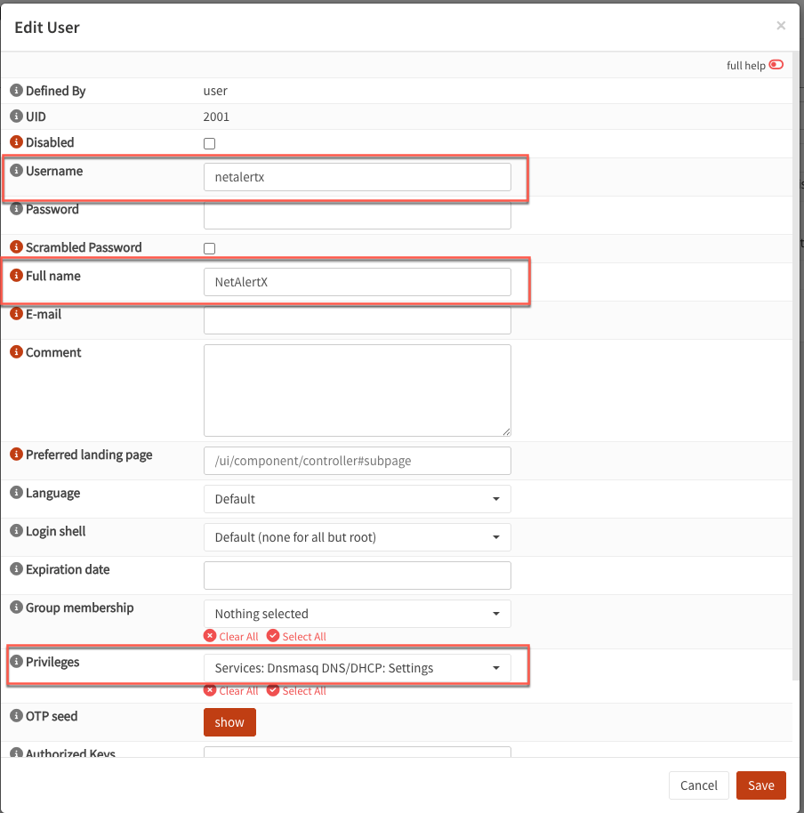
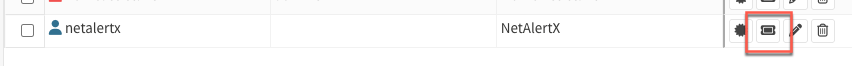
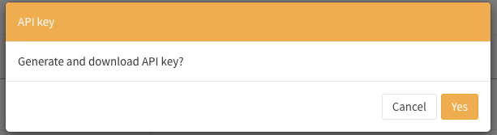
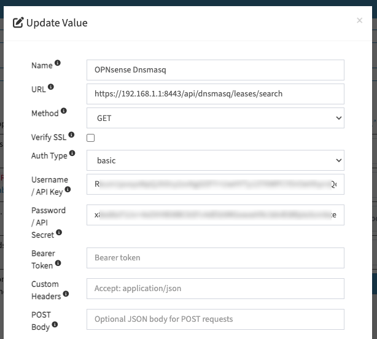
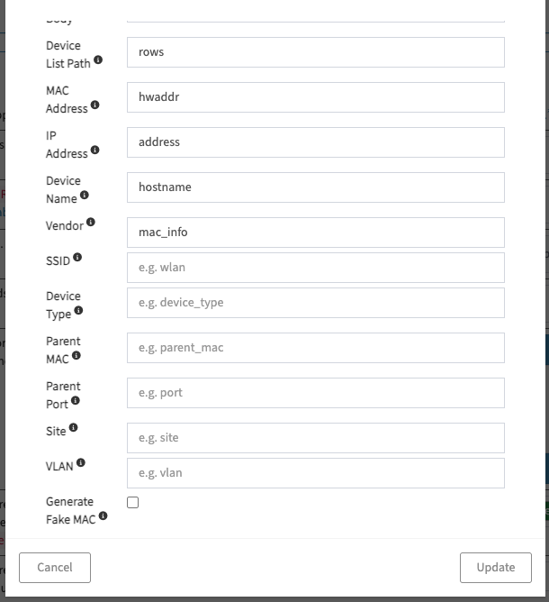

# RSTIMPRT plugin OPNsense/Dnsmasq setup

This guide shows you how to configure **OPNsense/Dnsmasq** in the **RSTIMPRT** plugin.

## 1. Create an OPNsense user
1. In OPNsense, navigate to **System** → **Access** → **Users**
2. Click the **+** to add a new user
3. Give your user a name (e.g., `netalertx`) and a Full name (e.g., `NetAlertX`) 
4. Assign privilege: `Services: Dnsmasq DNS/DHCP: Settings`
5. Click **Save**

## 2. Create an OPNsense API key
1. On the OPNsense Users screen, click the **AP Key** button next to your new user

2. Click **Yes** when prompted to generate and download the new key.  You'll receive a text file with a `key` and a `secret`.

## 3. Configure the RSTIMPRT plugin
1. In NetAlertX, navigate to **Settings** → **Core** → **Loaded plugins** and add `RSTIMPRT` 
2. Click **Save**
3. Navigate to **Settings** → **Core** → **Device scanners** and expand `RSTIMPRT` 
4. Under **RSTIMPRT_imports**, click **Add** 
5. Enter the following connection info:
    - Name: Whatever you'd like to call this REST instance (e.g., `OPNsense Dnsmasq`)
    - URL: Full URL to the API endpoint (e.g., `https://192.168.1.1:8443/api/dnsmasq/leases/search`)
    - Method: `GET`
    - Auth Type: `basic`
    - Username / API Key: The `key` value from your downloaded API key file
    - Password / API Secret: The `secret` value from your downloaded API key file
      

6. In the same window, enter the following field mappings:
    - Device List Path: `rows`
    - MAC Address: `hwaddr`
    - IP Address: `address`
    - Device Name: `hostname`
    - Vendor: `mac_info`

7. Click **Update**
8. Click **Save**