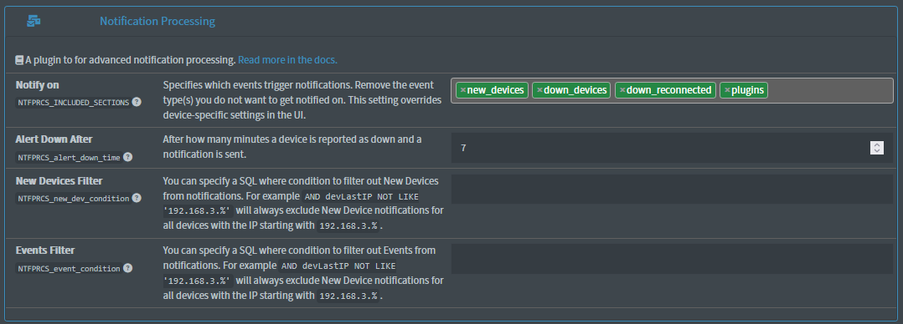
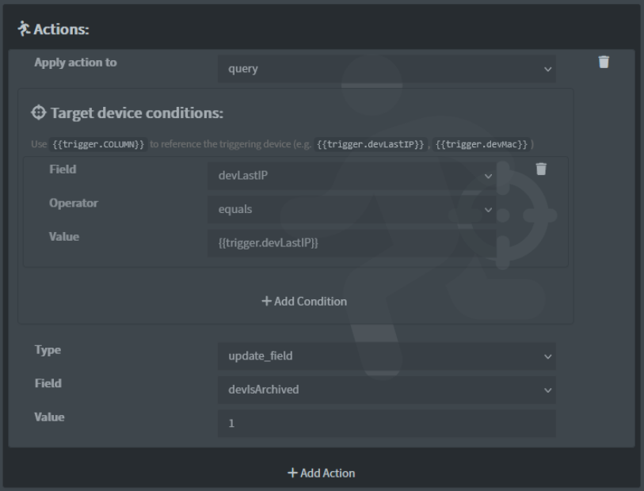
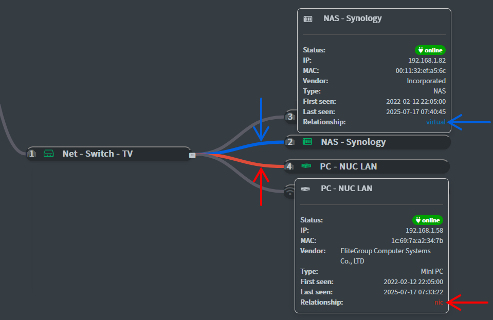
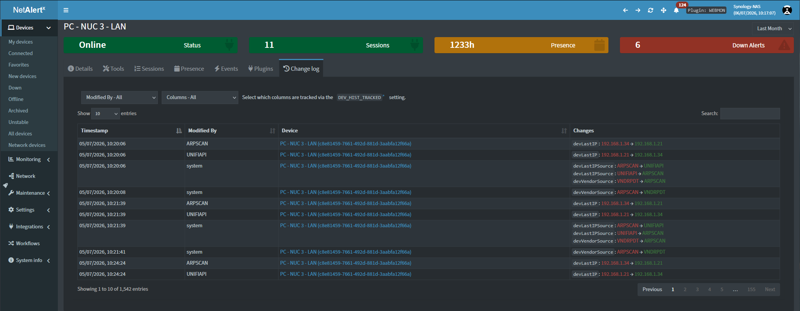
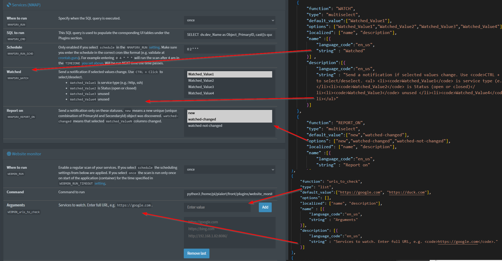

# Where NetAlertX Fits

Understanding where NetAlertX fits in your network management toolkit makes it easier to get the most from it.

Modern networks are typically managed using several specialized tools. One application may monitor uptime, another may capture packets, another may enforce firewall rules, while another documents the network.

NetAlertX fills a different role: it provides **continuous network visibility** by discovering devices, maintaining an accurate asset inventory, detecting changes, and notifying you when something important happens.

It answers one of the most common questions in network administration:

> **What is on my network, and what has changed?**

---

## What NetAlertX Does

NetAlertX continuously discovers devices using one or more discovery plugins and builds a living inventory of your network.

Depending on your configuration, it can collect information including:

* IP addresses
* MAC addresses
* Hostnames
* Vendors
* Device types
* Open ports
* Network interfaces
* Parent/child relationships
* First and last seen timestamps
* Custom metadata

Because discovery runs continuously, your inventory stays up to date automatically.

Learn more about the available discovery methods in the [Plugins](./PLUGINS.md) documentation.

---

## Detecting Change

Knowing what exists on your network is useful.

Knowing **what changed** is often even more valuable.

NetAlertX continuously records changes such as:

* New devices
* Devices going offline or coming back online
* IP address changes
* Hostname changes
* Vendor identification
* Open port changes (via the `NMAP` [plugin](./PLUGINS.md))
* Devices returning after long periods offline
* Configuration updates

These changes become events that can be viewed historically, filtered, searched, or used to trigger automation.

---

## Notifications

Not every event deserves immediate attention.

NetAlertX lets you choose which events [generate notifications](./NOTIFICATIONS.md) so that important alerts stand out without creating unnecessary noise.

Examples include:

* Unknown devices joining the network
* Critical infrastructure becoming unavailable
* IP address changes
* Port changes
* Custom workflow events

Notification publishers can be enabled independently, allowing NetAlertX to integrate with your existing communication channels.

---

## Automation

As networks grow, manually responding to every event quickly becomes impractical.

NetAlertX includes a [workflow engine](./WORKFLOWS.md) that can automatically react to events.

Typical automations include:

* Mark trusted devices automatically
* Assign devices to groups
* Update fields
* Archive old devices with the same IP
* Assign devices to the right parent node

Automation helps keep device management consistent while reducing repetitive administrative work.

---

## Device Relationships

Networks are more than collections of independent devices.

Devices often depend on one another.

Examples include:

* Access points connected to switches
* Virtual machines hosted by physical servers
* Containers running on hosts
* Network interfaces belonging to a parent device
* IoT gateways connected to sensors

NetAlertX supports [device relationships](./NETWORK_TREE.md) to better represent how devices are connected and how they depend on each other.

---

## Historical Visibility

Many monitoring systems focus only on the current state.

NetAlertX also records historical information, helping you understand how devices behave over time.

You can answer questions like:

* When was this device first discovered?
* When was it last online?
* How does its network presence change over time?
* Which configuration attributes have changed?

Historical data provides operational context without requiring a separate logging platform.

Two key views help explore this history:

* **Presence View** – when a device was active on the network
* **Change log** – what changed in the device’s configuration over time

---

## Change log

The **Change log** records all tracked changes to device attributes, showing what changed and when it happened.

Each entry includes:

* Timestamp of the change
* Previous and new values
* Source of the change (plugin, workflow, or user action)

You can filter, search, and sort changes to quickly investigate events such as IP changes, hostname updates, VLAN changes, or device classification updates.

| View              | Answers             |
| ----------------- | ------------------- |
| **Presence View** | When was it active? |
| **Change log**    | What changed?       |

---

## Plugin Architecture

 

Every environment is different.

Some users prefer simple ARP scanning.

Others rely on:

* SNMP
* DHCP leases
* Router integrations
* Pi-hole
* Virtualization platforms
* Cloud services
* External asset inventories

NetAlertX is built around a plugin architecture that allows multiple discovery sources to work together, improving accuracy while remaining flexible.

See the complete list in [Plugins](./PLUGINS.md).

---

## Integrations

NetAlertX is designed to complement your existing infrastructure rather than replace it.

It integrates with many popular platforms, including:

* Home Assistant
* Pi-hole
* MQTT
* Notification services
* REST APIs
* Custom workflows

This allows NetAlertX to become part of your existing automation and monitoring ecosystem.

---

## How NetAlertX Compares

The following diagram illustrates how NetAlertX complements other common network tools.

| Need | Typical Tool | NetAlertX Role |
| --- | --- | --- |
| Device discovery | ✅ | **Core capability** |
| Asset inventory | ✅ | **Core capability** |
| Detect network changes | ✅ | **Core capability** |
| Historical device tracking | ✅ | **Core capability** |
| Notifications | ✅ | **Core capability** |
| Automation | ✅ | **Core capability** |
| Packet inspection | Wireshark | Not intended |
| Firewall enforcement | pfSense, OPNsense | Not intended |
| IDS/IPS | Suricata, Snort | Not intended |
| Network documentation | NetBox, NetMap | Complements them |
| Uptime monitoring | Uptime Kuma, Nagios | Complements them |

NetAlertX works best alongside these tools, providing the continuously updated device inventory that many monitoring platforms lack.

---

## Typical Deployments

### 🏠 Home Networks

Monitor:

* Family devices
* Smart home equipment
* NAS systems
* TVs and media devices
* Game consoles
* IoT devices

Receive alerts whenever new or unknown devices join your network.

---

### 🧪 Homelabs

Track constantly changing environments including:

* Docker containers
* Virtual machines
* Kubernetes nodes
* Development systems
* Test networks

Maintain an accurate inventory without manual documentation.

---

### 🏢 Small Businesses

Maintain visibility across office networks by tracking:

* Unauthorized devices and shadow IT
* Office infrastructure and critical core systems
* Real-time asset inventory drift

---

### 🌍 Remote Sites

Deploy NetAlertX at branch offices or remote locations to maintain local visibility while monitoring multiple sites centrally.

---

## What NetAlertX Is Designed To Do

NetAlertX is designed to excel at:

* Continuous device discovery
* Asset inventory
* Network visibility
* Change detection
* Historical tracking
* Notifications
* Workflow automation
* Plugin extensibility

By focusing on these capabilities, NetAlertX remains lightweight, flexible, and easy to integrate into existing environments.

---

## What NetAlertX Is Not

NetAlertX is **not** intended to replace:

* Firewalls
* Packet analyzers
* IDS/IPS platforms
* Configuration management systems
* Network documentation platforms
* Dedicated uptime monitoring systems

Instead, it complements these tools by providing continuous awareness of the devices connected to your network.

---

## Next Steps

Now that you understand where NetAlertX fits, continue with one of the following guides:

* **[Installation](INSTALLATION.md)** — Install NetAlertX on your platform.
* **[Plugins](./PLUGINS.md)** — Configure device discovery.
* **[Features](FEATURES.md)** — Explore everything NetAlertX can do.
* **[API](API.md)** — Integrate NetAlertX with your own applications.