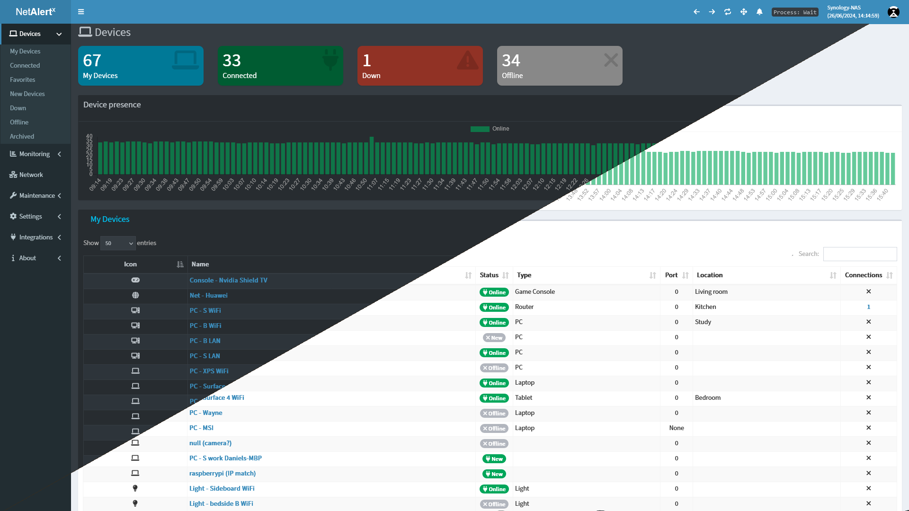

---
hide:
  - navigation
  - toc
---

  

    <h1>NetAlertX</h1>
    

      Centralized network visibility and continuous asset discovery.
    

    

     NetAlertx delivers a scalable and secure solution for comprehensive network monitoring, supporting security awareness and operational efficiency.
    

  

  

    
  

  

    <h3>Learn</h3>
    
Understand NetAlertX core features, discovery, and alerting concepts

    <a href="./FEATURES" class="promo-button">
      Explore Features
    </a>
  

  

    <h3>Install</h3>
    
Step-by-step installation guides for Docker, Home Assistant, Unraid, and bare-metal setups

    <a href="./INSTALLATION" class="promo-button">
      View Installation Guides
    </a>
  

  

    <h3>Notifications</h3>
    
Learn how NetAlertX provides device presence, alerting, and compliance-friendly monitoring

    <a href="./NOTIFICATIONS" class="promo-button">
      Explore Notifications
    </a>
  

  

    <h3>Contribute</h3>
    
Source code, development environment setup, and contribution guidelines

    <a href="./DEV_ENV_SETUP" class="promo-button">
      Contribute on GitHub
    </a>
  

---

## Help and Support

If you need help or run into issues, here are some resources to guide you:

**Before opening an issue, please:**

  - **Hover over settings, fields, or labels** to see additional tooltips and guidance.
  - **Click ? (question-mark) icons** next to various elements to view detailed information.
  - [Check common issues](./DEBUG_TIPS.md#common-issues) to see if your problem has already been reported.
  - [Look at closed issues](https://github.com/netalertx/NetAlertX/issues?q=is%3Aissue+is%3Aclosed) for possible solutions to past problems.
  - **Enable debugging** to gather more information: [Debug Guide](./DEBUG_TIPS.md).

**Need more help?** Join the community discussions or submit a support request:

  - Visit the [GitHub Discussions](https://github.com/netalertx/NetAlertX/discussions) for community support.
  - If you are experiencing issues that require immediate attention, consider opening an issue on our [GitHub Issues page](https://github.com/netalertx/NetAlertX/issues).

---

## Contributing

NetAlertX is open-source and welcomes contributions from the community! If you'd like to help improve the software, please follow the guidelines below:

- **Fork the repository** and make your changes.
- **Submit a pull request** with a detailed description of what you’ve changed and why.

For more information on contributing, check out our [Dev Guide](./DEV_ENV_SETUP.md).

---

## Stay Updated

To keep up with the latest changes and updates to NetAlertX, please refer to the following resources:

- [Releases](https://github.com/netalertx/NetAlertX/releases)

Make sure to follow the project on GitHub to get notifications for new releases and important updates.

---
## Additional info

- **Documentation Index**: Check out the full [documentation index](https://github.com/netalertx/NetAlertX/tree/main/docs) for all the guides available.

If you have any suggestions or improvements, please don’t hesitate to contribute!

NetAlertX is actively maintained. You can find the source code, report bugs, or request new features on our [GitHub page](https://github.com/netalertx/NetAlertX).
