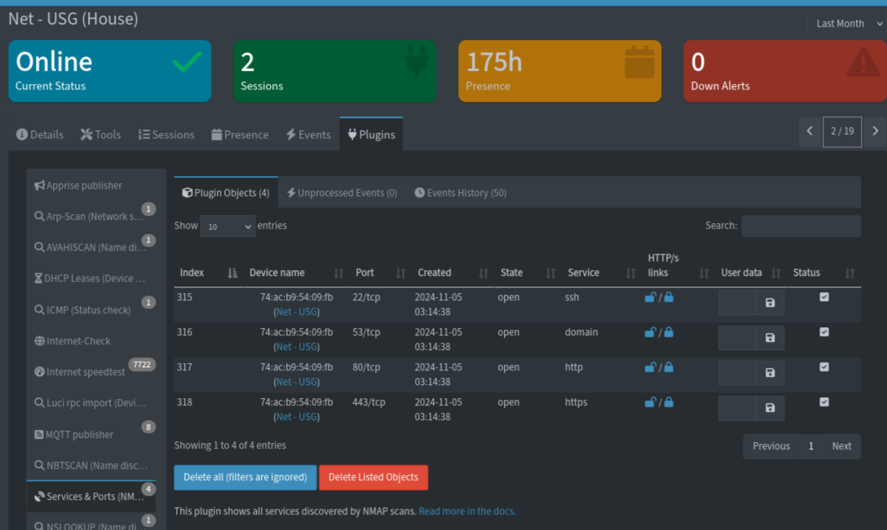

## Overview

Scans your known devices for open ports and the services running on them, using NMAP. Only IPs reachable from the app container are scanned. Results show up as a per-device list of open ports/services, and can optionally trigger a notification when a device's port list changes (e.g. a new service appears).

### Usage

- Check the Settings page for details.

### Notes

